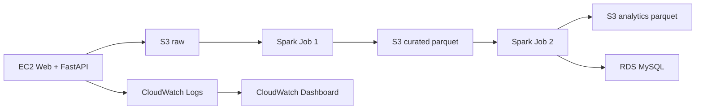

# CRISP-DM 04 - Modeling

## Arquitectura

## Cluster Spark

- EC2-1: Spark Master.
- EC2-2, EC2-3, EC2-4: Spark Workers.
- EC2-5: Submit node.
- EC2-6: Web + FastAPI + CloudWatch Agent.

## Productos analiticos

Producto A: funnel diario.

- `sessions_total`
- `sessions_event_list`
- `sessions_event_detail`
- `sessions_begin_checkout`
- `sessions_purchase`
- `conversion_rate`

Producto B: interes vs ingresos.

- `detail_views`
- `purchases`
- `revenue_total`
- `interest_to_purchase_ratio`

Producto C: anomalias.

- Regla por umbrales verificables: requests altos, errores altos, latencia alta o IP repetitiva.
- Salida con `is_anomaly` y `reason`.
